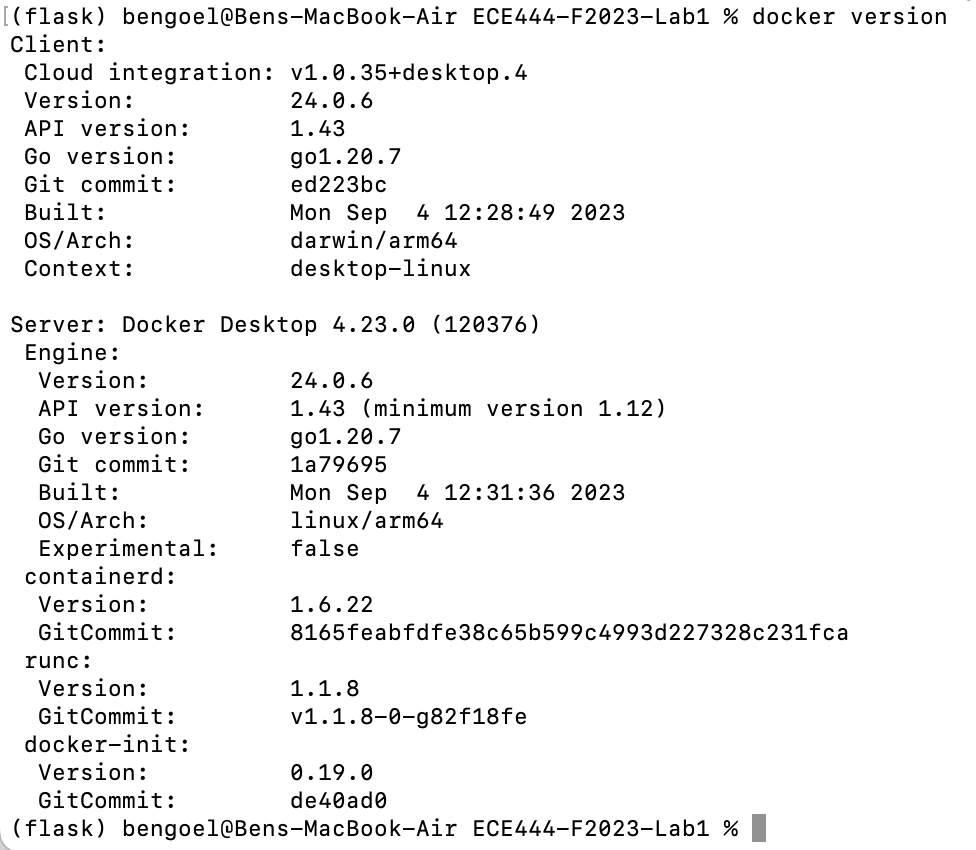
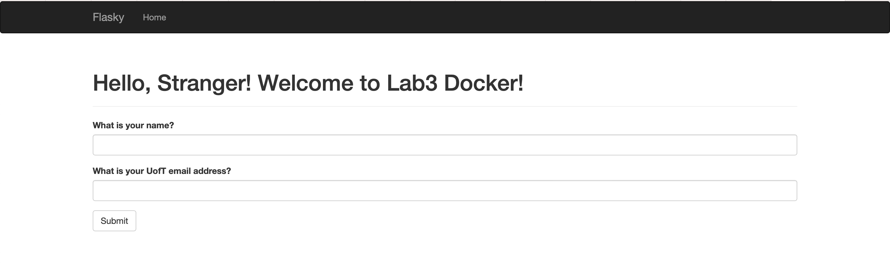
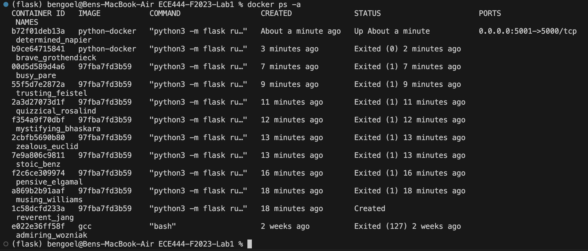
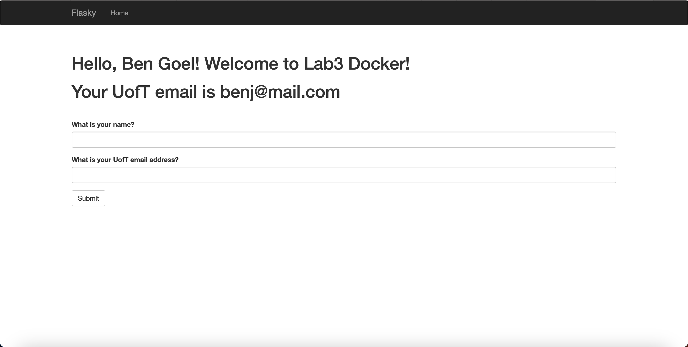

# ECE444-F2023-Lab3
Name: Benjamin Goel

Note: This repository is a clone of https://github.com/miguelgrinberg/flasky

## Activity 1
See that the default branch is now `lab3`
## Activity 2

## Activity 3

## Activity 4

